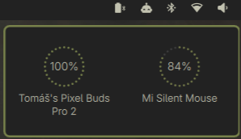
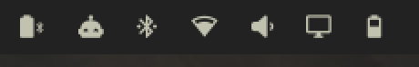

# Peripheral Battery Indicator

Battery levels for your wireless **mouse, keyboard, headset & controllers**,
right in the Omarchy bar. A single battery-bluetooth icon sits in the bar and
turns amber then red as something runs low; click it for a popup listing
every device with its charge, and get a desktop notification before a
device dies. Hover the bar icon for a quick "Mouse 15%" without opening the
popup.




## Features

- **One tidy bar icon** — `battery-bluetooth` glyph, tinted amber at warning
  and red at critical. No clutter of per-device chips. Hover it for the
  neediest device's name and charge without opening the popup.
- **Click-through popup** — click the icon for the full list (icon, name,
  charge %, mini bar, charging bolt). Click anywhere else to dismiss.
- **Two-tier notifications** — normal urgency at the warning threshold,
  critical urgency below that; re-armed on recharge, with an optional
  repeat while still low so you don't miss it.

## Install

```bash
omarchy plugin add https://github.com/hlasensky/omarchy-peripheral-battery.git --enable
```

Plugins land **disabled** until you review them; `--enable` opts in. It drops
into the bar's right section — move it with `omarchy bar move
hl.peripheral_battery --section <left|center|right>`.

## Update

```bash
omarchy plugin update hl.peripheral_battery
```

## Uninstall

```bash
omarchy plugin remove hl.peripheral_battery
```

This disables the widget, removes it from the bar (`shell.json`), and deletes
the plugin from `~/.config/omarchy/plugins/`.

## Requirements

- `upower` (ships with Omarchy).
- The device must report battery to UPower. Most USB-dongle and Bluetooth
  peripherals do; some BT headsets need the experimental BlueZ battery plugin.
- A Nerd Font as the bar font (Omarchy default) — the icons are Nerd Font
  glyphs.

## Settings

Configure from **Setup → Plugins**, or edit the widget entry in
`~/.config/omarchy/shell.json`.

| Key                    | Type        | Default                            | What it does                              |
|------------------------|-------------|-------------------------------------|-------------------------------------------|
| `lowThreshold`         | integer     | 20                                  | % at/below which a device is "warning"    |
| `criticalThreshold`    | integer     | 10                                  | % at/below which a device is "critical"   |
| `hideLaptopBattery`    | boolean     | true                                | Hide the laptop's own battery             |
| `notifyOnLow`          | boolean     | true                                | Desktop notification on low               |
| `notifyRepeatMinutes`  | integer     | 0                                   | Re-notify every N minutes while still low (0 = once) |
| `deviceTypes`          | multiselect | mouse, keyboard, headset, gamepad   | Which device types to show                |

## How it works

Two data paths, picked automatically at startup:

- **Path A (native):** imports `Quickshell.Services.UPower` and iterates
  `UPower.devices`. Event-driven, zero polling.
- **Path B (fallback):** if that module isn't present, enumerates `upower -e`
  and parses each `upower -i <path>` block. A 30s timer backs it up.

The bar widget (`bar-widget`) and the data source (`service`) are both declared
in `manifest.json`.

## License

MIT — see [LICENSE](LICENSE).
