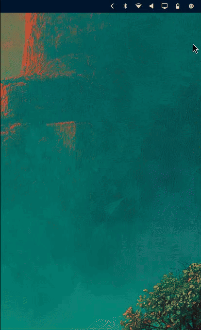
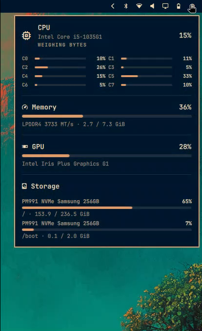
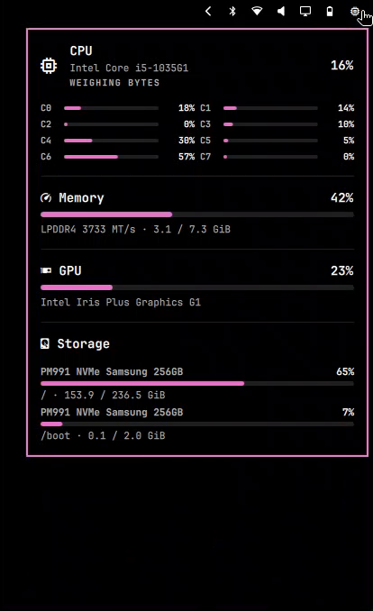

# Hardware Tooltip

An Omarchy bar widget that names the silicon in the machine, then stays out of the way.

Hover the chip for a Power-style panel: CPU model and per-core bars, RAM type and speed, GPU name and load, disk model and fill. It follows the active Omarchy theme. Click opens `btop` if you want the full TUI.

<p align="center">
  
</p>

<p align="center">
  
  
</p>

| Hover | Click |
| --- | --- |
| CPU name, per-core bars, RAM type/speed, GPU name, storage model and mounts | Launch or focus `btop` |

Load-aware status lines rotate the same way the Power panel does — idle machines loaf, busy GPUs push pixels, a local model run starts chewing context.

## Why this exists

Omarchy Quattro's bar no longer ships a glance for *what this computer is*. Other listed plugins cover adjacent jobs:

- **btop Activity** — a btop companion: launch, window mode, process sort, compact meters
- **System Stats / Vitals / Activity Monitor** — full monitors with tabs, graphs, or process control

Hardware Tooltip is the other thing: a themed hover you can read in one look, with hardware identity on the labels, not just percentages. It is not a btop frontend.

## ASRock BC-250

Tuned for the BC-250 / Cyan Skillfish board (`1002:13fe`). Linux binds the GPU as `amdgpu`, but SMU telemetry on this cut-down Oberon part is empty, so generic AMD tools report a stuck `0%`:

| Signal | What Linux does on a BC-250 |
| --- | --- |
| `gpu_busy_percent` | node exists, `read()` returns `ENOTSUPP` |
| `gpu_metrics` `average_gfx_activity` | stays `0xFFFF` |
| `radeontop` | unknown card, stuck `0%` |
| DIMM / SPD | none — 16 GB soldered GDDR6, `dmidecode` / `inxi` show type `N/A` and a `1750 MT/s` command clock |

This widget:

- samples GPU load from `/proc/*/fdinfo` `drm-engine-*` time (Render/3D) instead of the broken busy node
- labels memory as **GDDR6 14000 MT/s** from the published 14 Gbps-per-pin spec, not the command clock

Ordinary Radeons still use `gpu_busy_percent`. Intel uses DRM fdinfo / RC6. NVIDIA uses `nvidia-smi` only when the driver is actually loaded.

The 16 GB of unified memory is soldered GDDR6, not DIMMs, so `dmidecode` / `inxi` report `type: N/A` (the panel used to show a lone **N**) and a single `1750 MT/s` command clock. There is no SPD to read. On PCI `1002:13fe` / DMI `BC-250` the widget uses the published 14 Gbps-per-pin spec as **GDDR6 14000 MT/s**.

## Install

Plugins run as unsandboxed code inside `omarchy-shell`. Only add repos you trust.

```bash
omarchy plugin add https://github.com/IM0001GT/omarchy-hw-tooltip --enable
```

That clones into `~/.config/omarchy/plugins/im0001gt.hw-tooltip/`, validates the manifest, and can drop the widget on the right side of the bar, next to Power.

Intel and AMD need no extra packages and no sysctl changes. On NVIDIA, if `nvidia-smi` is missing:

```bash
~/.config/omarchy/plugins/im0001gt.hw-tooltip/install.sh --deps
```

`--deps` is optional. Without it the widget still works; a missing NVIDIA tool just shows `n/a` for GPU.

### One-shot from a clone

```bash
git clone https://github.com/IM0001GT/omarchy-hw-tooltip.git
cd omarchy-hw-tooltip
./install.sh
```

## Use

- **Hover** the chip — panel with CPU, memory, GPU, and storage
- **Click** — launch or focus `btop`

The panel sizes itself to the hardware in the machine: more CPU threads add columns and height, extra disks grow the storage block, and the card still stops at the screen edge. On a 16-core / 32-thread desktop the thread grid uses four columns so Memory, GPU, and Storage stay on screen.

Move it with `omarchy bar move im0001gt.hw-tooltip`.

## Update

```bash
omarchy plugin update im0001gt.hw-tooltip --yes
omarchy restart shell
```

`omarchy plugin update` only fast-forwards the git checkout. Quickshell can keep the previous QML in memory until the shell restarts. `./install.sh` does the update and the restart together.

## Uninstall

```bash
omarchy plugin remove im0001gt.hw-tooltip
```

Current releases do not leave a sysctl drop-in. If an older `btop-monitor` install set `kernel.perf_event_paranoid=0`:

```bash
~/.config/omarchy/plugins/im0001gt.hw-tooltip/install.sh --deps
```

or by hand:

```bash
sudo rm -f /etc/sysctl.d/99-omarchy-btop-monitor.conf /etc/sysctl.d/50-perf-event.conf
sudo sysctl -w kernel.perf_event_paranoid=2
```

## Requirements

- [Omarchy](https://omarchy.org/) with the shell plugin CLI (`omarchy plugin add`)
- `btop` and `jq` (already on Omarchy)
- Optional NVIDIA tools, only if `nvidia-smi` is missing

| GPU | Extra package | How load is read |
| --- | --- | --- |
| Intel | none | DRM fdinfo engine busy, then RC6 residency. No `kernel.perf_event_paranoid` change |
| NVIDIA | `nvidia-utils` | `nvidia-smi`, and only when the NVIDIA driver is loaded |
| AMD | none | `gpu_busy_percent`. If that node is missing or `ENOTSUPP` (BC-250), DRM fdinfo engine time |

Hybrid laptops use the first source that actually returns a reading.

## Layout

```text
manifest.json          Omarchy plugin manifest (must live at repo root)
HardwareTooltip.qml    Bar icon + hover panel
preview.gif            README demo
preview.png            Marketplace still (teal theme)
docs/theme-night.png   Same panel after a theme change
scripts/system-usage   CPU / RAM / GPU / disk sampler
install.sh             Optional NVIDIA deps + enable / place the widget
```

The repo root **is** the plugin. That is what `omarchy plugin add` and `omarchy plugin validate` expect.

## License

MIT. See [LICENSE](LICENSE).
